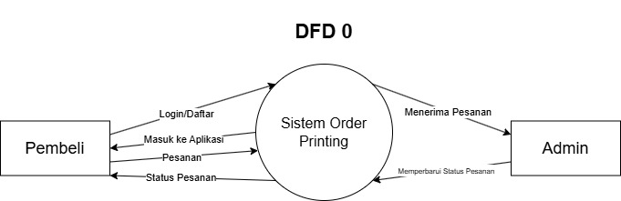
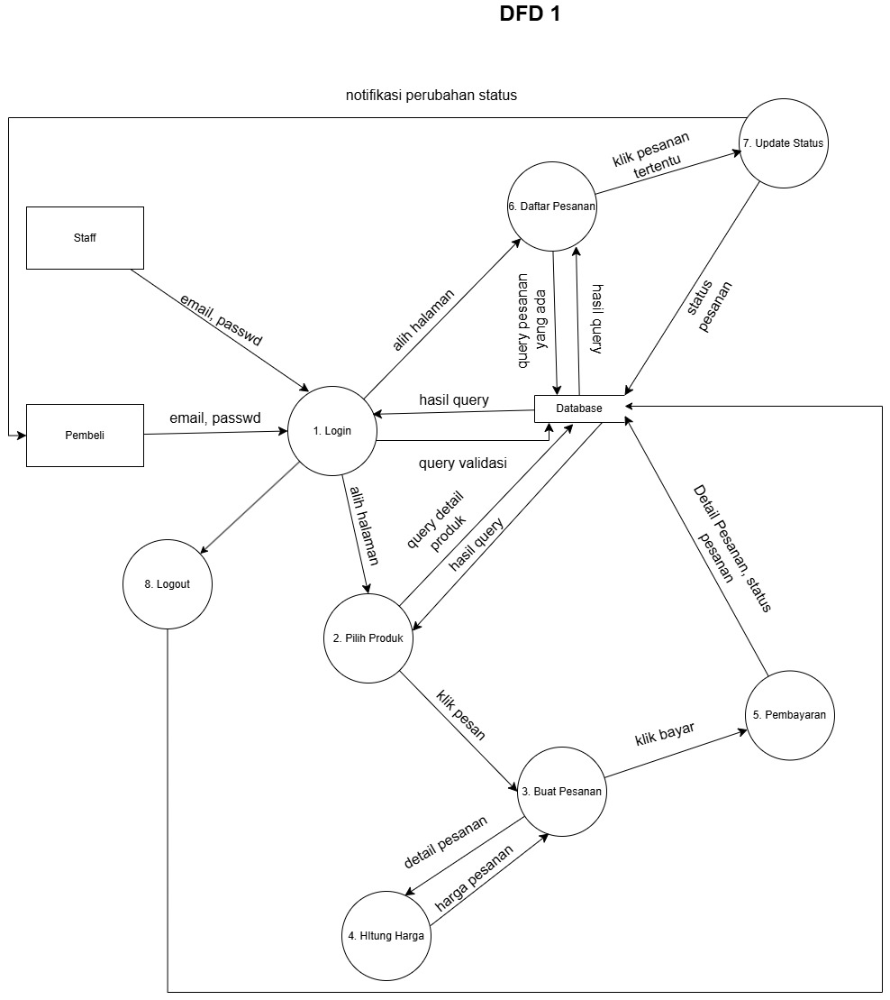
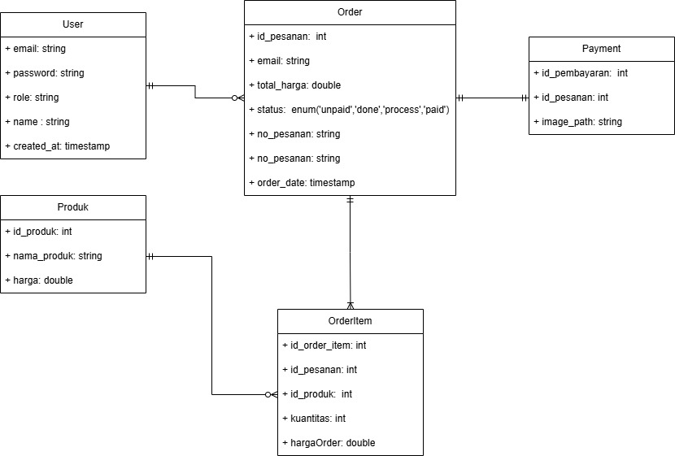
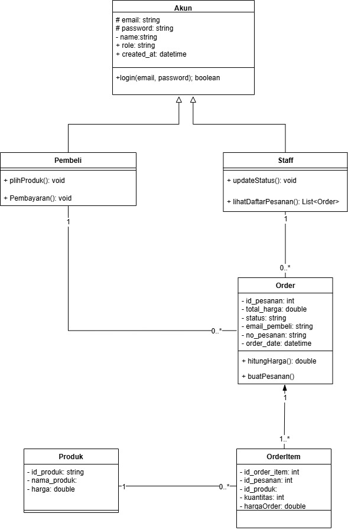
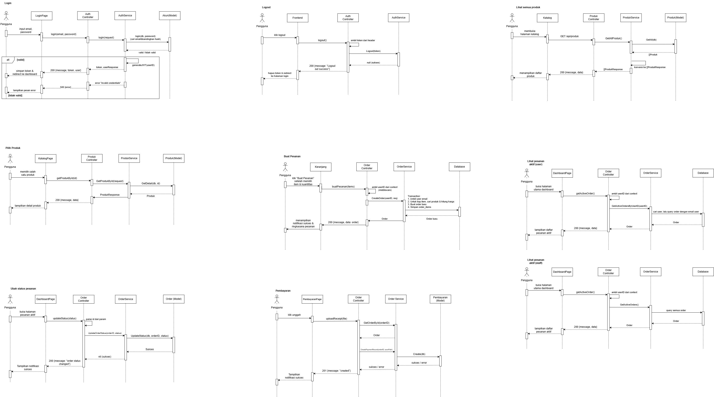
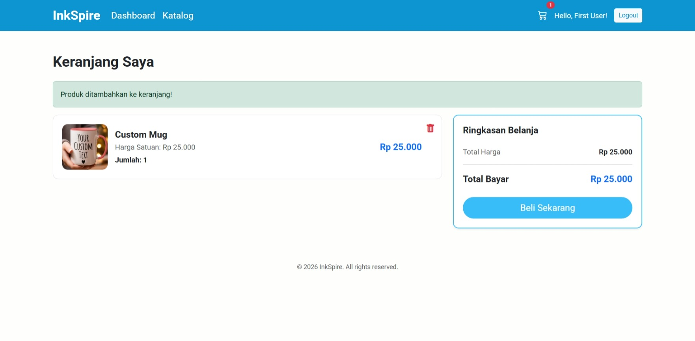
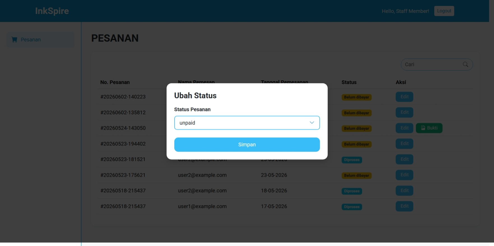

# 🚀 Tugas Besar: InkSpire

> **Dosen Pengampu:** Muhammad Shiddiq Azis, S.T., MBA

---

## 📊 Perancangan Sistem (DFD)

### DFD Level 0
 
*Diagram Konteks yang menunjukkan aliran data global.*

### DFD Level 1
 
*Detail proses bisnis dan integrasi database.*

### ERD 
 

### Class Diagram

### Sequence Diagram
 

---

## 🎨 Mockup Antarmuka
Rancangan UI aplikasi yang berfokus pada pengalaman pengguna.

## 📸 Mockup Sistem

### Authentication

|                               Login User                               |
| :--------------------------------------------------------------------: |
|  |

### Dashboard

|                                   Dashboard User                                   |                                 Dashboard Admin                                 |
| :--------------------------------------------------------------------------------: | :-----------------------------------------------------------------------------: |
|  |  |

### Katalog Produk

|                                        Katalog                                        |
| :-----------------------------------------------------------------------------------: |
|  |

### Pemesanan

|                              Form Pemesanan                              |
| :----------------------------------------------------------------------: |
|  |

### Keranjang

|                          Keranjang Belanja                         |
| :----------------------------------------------------------------: |
|  |

### Pembayaran

|                                 Pembayaran                                |
| :-----------------------------------------------------------------------: |
|  |

### Riwayat Pesanan

|                                  Riwayat Pesanan                                 |
| :------------------------------------------------------------------------------: |
|  |

### Manajemen Status Pesanan

|                                   Ubah Status Pesanan                                  |
| :------------------------------------------------------------------------------------: |
|  |

---

## 📄 Dokumentasi

| Dokumen                              | Tautan                                                                                           |
| ------------------------------------ | ------------------------------------------------------------------------------------------------ |
| User Manual                          | [📄 Buka Dokumen](docs/manual/Panduan%20User%20Manual.pdf)                                       |
| User Manual & Test Plan Terintegrasi | [📄 Buka Dokumen](docs/manual/Standar%20User%20Manual%20%26%20Test%20Plan%20Terintegrasi%20.pdf) |
| Test Plan Frontend                   | [📄 Buka Dokumen](docs/manual/Test%20Plan%20-%20Frontend%20-%20Inkspire.pdf)                     |

## 🛠️ Stack Teknologi
- **Frontend:** Laravel
- **Backend:** Go
- **Database:** MySQL

---

## 📂 Cara Instalasi
1. `git clone https://github.com/fagiantz/InkSpire`
2. `npm install` (atau sesuaikan dengan environment)
3. `npm run dev`
