TESTING METRICS REPORT

Mata Kuliah : Implementasi dan Pengujian Perangkat Lunak (IMPAL)
Nama Aplikasi : InkSpire
Repository https://github.com/fagiantz/InkSpire
Website https://inkspire.biz.id

1. Deskripsi Aplikasi
InkSpire merupakan aplikasi berbasis web yang digunakan untuk membantu proses pemesanan jasa percetakan secara online. Melalui aplikasi ini, pengguna dapat melihat katalog produk, melakukan pemesanan, mengunggah bukti pembayaran, serta memantau status pesanan. Selain itu, tersedia halaman admin yang digunakan untuk mengelola pesanan dan memperbarui statusnya sehingga proses pelayanan dapat berjalan lebih mudah.
2. Fitur yang Diuji
Pada proses pengujian ini, fitur yang diuji merupakan fitur-fitur utama yang tersedia pada aplikasi InkSpire. Pengujian dilakukan dengan mencoba setiap fitur secara langsung untuk melihat apakah fungsi yang diberikan sudah berjalan sesuai dengan kebutuhan pengguna.
No	Fitur	Keterangan
1	Login	Mencoba proses login menggunakan akun yang benar maupun akun yang salah.
2	Dashboard Pengguna	Melihat apakah dashboard dapat ditampilkan setelah pengguna berhasil login.
3	Katalog Produk	Membuka halaman katalog untuk melihat seluruh produk yang tersedia.
4	Detail Produk	Membuka salah satu produk dan mengecek informasi yang ditampilkan.
5	Keranjang Belanja	Menambahkan dan menghapus produk pada keranjang belanja.
6	Checkout	Melakukan checkout hingga sistem membuat pesanan dan mengarahkan ke halaman pembayaran.
7	Upload Bukti Pembayaran	Mengunggah bukti pembayaran untuk pesanan yang telah dibuat.
8	Status Pesanan	Melihat perkembangan status pesanan setelah pembayaran dikirim.
9	Daftar Pesanan	Mengecek apakah seluruh pesanan yang pernah dibuat muncul pada daftar pesanan.
10	Dashboard Admin	Membuka halaman admin untuk melihat data pesanan yang masuk.
11	Update Status Pesanan	Mengubah status salah satu pesanan dan melihat apakah perubahan berhasil disimpan.
12	Logout	Keluar dari aplikasi dan memastikan pengguna kembali ke halaman login.

3. Test case
No	Fitur	Skenario Pengujian	Hasil yang Diharapkan	Hasil Pengujian	Status
1	Login	Login menggunakan email dan password yang benar.	Pengguna berhasil masuk ke dashboard.	Berhasil login dan diarahkan ke halaman dashboard.	PASS
2	Login	Login menggunakan password yang salah.	Sistem menolak login dan menampilkan pesan kesalahan.	Muncul pesan "Invalid credentials" dan pengguna tetap berada di halaman login.	PASS
3	Login	Login tanpa mengisi email dan password.	Sistem meminta pengguna mengisi data yang masih kosong.	Browser menampilkan pesan "Isi isian ini" sehingga form tidak dapat dikirim.	PASS
4	Dashboard	Membuka dashboard setelah login.	Dashboard dapat ditampilkan dengan baik.	Dashboard berhasil dibuka dan seluruh menu tampil normal.	PASS
5	Katalog Produk	Membuka halaman katalog produk.	Daftar produk dapat ditampilkan.	Semua produk berhasil ditampilkan pada halaman katalog.	PASS
6	Detail Produk	Memilih salah satu produk pada katalog.	Informasi detail produk ditampilkan.	Detail produk berhasil ditampilkan lengkap.	PASS
7	Keranjang Belanja	Menambahkan produk ke keranjang.	Produk masuk ke dalam keranjang.	Produk berhasil ditambahkan dan tampil pada halaman keranjang.	PASS
8	Keranjang Belanja	Menghapus produk dari keranjang.	Produk berhasil dihapus dari keranjang.	Produk berhasil dihapus dan daftar keranjang langsung diperbarui.	PASS
9	Checkout	Melakukan checkout dari keranjang.	Sistem membuat pesanan dan mengarahkan ke halaman pembayaran.	Checkout berhasil dan pengguna diarahkan ke halaman pembayaran.	PASS
10	Upload Bukti Pembayaran	Mengunggah bukti pembayaran.	Bukti pembayaran berhasil disimpan.	Bukti pembayaran berhasil diunggah dan muncul notifikasi bahwa pembayaran berhasil dikirim.	PASS
11	Status Pesanan	Membuka halaman status pesanan.	Status pesanan dapat dilihat.	Status pesanan berhasil ditampilkan dan sesuai dengan pesanan yang dibuat.	PASS
12	Daftar Pesanan	Membuka halaman daftar pesanan.	Riwayat pesanan ditampilkan.	Daftar pesanan berhasil ditampilkan dan pesanan terbaru muncul pada daftar.	PASS
13	Dashboard Admin	Login menggunakan akun admin dan membuka dashboard.	Dashboard admin dapat diakses.	Dashboard admin berhasil dibuka dan seluruh data pesanan tampil dengan baik.	PASS
14	Update Status Pesanan	Mengubah status salah satu pesanan.	Status pesanan berhasil diperbarui.	Status pesanan berhasil diperbarui dan perubahan berhasil disimpan.	PASS
15	Logout	Keluar dari sistem menggunakan menu logout.	Sistem mengakhiri sesi dan kembali ke halaman login.	Logout berhasil dan sistem kembali ke halaman login.	PASS

4. Testing Metrics
4.1 Ringkasan Hasil Pengujian
Pengujian dilakukan pada aplikasi InkSpire menggunakan metode Black Box Testing. Pengujian difokuskan pada fungsi-fungsi utama yang digunakan oleh pengguna dan admin. Selama proses pengujian, setiap fitur dicoba secara langsung untuk memastikan apakah hasilnya sudah sesuai dengan yang diharapkan.
Berdasarkan hasil pengujian yang telah dilakukan, diperoleh hasil sebagai berikut.
Keterangan	Hasil
Jumlah fitur yang diuji	13
Jumlah test case	15
Test case berhasil (PASS)	15
Test case gagal (FAIL)	0
Jumlah defect	0

4.2 Pass Rate
Pass Rate menunjukkan persentase test case yang berhasil dijalankan.
Pass Rate =  (Jumlah PASS)/(Total Test Case) × 100% = 5/15× 100% = 100%
Artinya seluruh skenario pengujian yang telah dilakukan berhasil dijalankan sesuai dengan hasil yang diharapkan.
4.3 Fail Rate
Fail Rate menunjukkan persentase test case yang gagal saat dilakukan pengujian.
Fail Rate =  (Jumlah FAIL)/(Total Test Case) × 100% = 0/15× 100% = 0% 
Dari hasil tersebut dapat disimpulkan bahwa selama proses pengujian tidak ditemukan test case yang gagal.
4.4 Defect Count
Defect Count digunakan untuk mengetahui jumlah bug yang ditemukan selama proses pengujian.
Tingkat Defect	Jumlah
Critical	0
Major	0
Minor	0
Total	0

Selama pengujian berlangsung tidak ditemukan bug yang menyebabkan fungsi aplikasi tidak berjalan sebagaimana mestinya.
4.5 Defect Density
Defect Density digunakan untuk melihat jumlah defect dibandingkan dengan jumlah fitur yang diuji.
Defect Density = (Jumlah Defect)/(Jumlah Fitur) = 0/13 = 0 bug per fitur
Hasil tersebut menunjukkan bahwa tidak ditemukan defect pada fitur yang telah diuji.
4.6 Ringkasan Hasil Pengujian
Status	Jumlah	Persentase
PASS	15	100%
FAIL	0	0%
Total	15	100%

4.7 Analisis Hasil Pengujian
Pengujian dilakukan dengan mencoba langsung setiap fitur yang ada pada aplikasi InkSpire, mulai dari proses login hingga pengelolaan pesanan oleh admin. Setiap fitur diuji berdasarkan alur penggunaan aplikasi agar dapat diketahui apakah fungsi yang tersedia sudah berjalan dengan baik.
Pada fitur login, sistem berhasil membedakan antara data yang benar dan data yang salah. Saat password yang dimasukkan tidak sesuai, sistem menampilkan pesan "Invalid credentials". Selain itu, ketika kolom email dikosongkan, browser menampilkan validasi "Isi isian ini" sehingga form tidak dapat dikirim sebelum data dilengkapi.
Pengujian kemudian dilanjutkan pada fitur katalog produk, detail produk, keranjang belanja, checkout, upload bukti pembayaran, status pesanan, dan daftar pesanan. Seluruh fitur tersebut dapat digunakan tanpa mengalami kendala. Produk berhasil ditambahkan ke keranjang, checkout berhasil dilakukan, bukti pembayaran dapat diunggah, dan informasi pesanan dapat ditampilkan dengan benar.
Pengujian juga dilakukan menggunakan akun admin. Dashboard admin berhasil menampilkan seluruh data pesanan dan perubahan status pesanan dapat disimpan dengan baik. Setelah proses selesai, fitur logout juga berhasil mengakhiri sesi pengguna dan mengarahkan kembali ke halaman login.
Secara keseluruhan, seluruh 15 test case memperoleh hasil PASS sehingga menghasilkan Pass Rate sebesar 100%. Selama pengujian tidak ditemukan bug yang memengaruhi fungsi utama aplikasi. Walaupun hasil pengujian menunjukkan aplikasi berjalan dengan baik, pengujian lain seperti uji performa, keamanan, dan kompatibilitas browser tetap perlu dilakukan agar kualitas aplikasi semakin baik ketika digunakan oleh banyak pengguna.

5. Dokumentasi Pengujian
Dokumentasi berikut merupakan hasil pengujian yang dilakukan pada aplikasi InkSpire menggunakan metode Black Box Testing. Setiap fitur diuji berdasarkan skenario yang telah ditentukan untuk memastikan bahwa sistem dapat berjalan sesuai dengan kebutuhan pengguna.

## 5.1 Pengujian Login Menggunakan Akun yang Valid

Pengguna berhasil login menggunakan email dan password yang benar sehingga sistem menampilkan halaman dashboard.

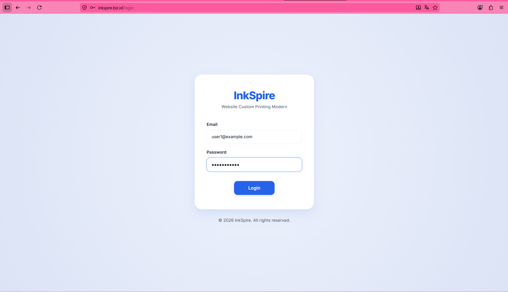

---

## 5.2 Pengujian Login dengan Password Salah

Pengguna memasukkan password yang salah dan sistem menampilkan pesan **Invalid Credentials**.

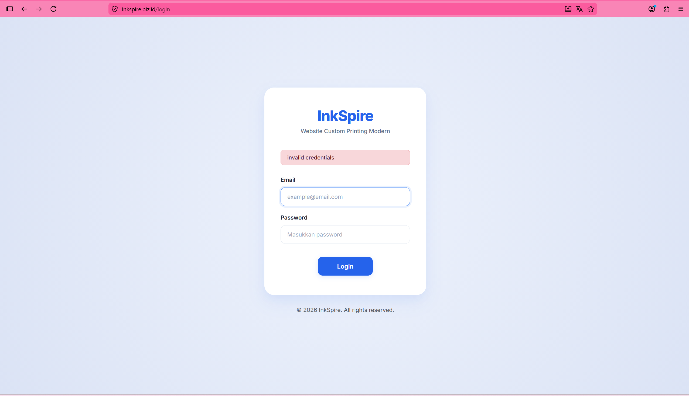

---

## 5.3 Pengujian Login Tanpa Mengisi Email dan Password

Pengguna menekan tombol login tanpa mengisi data sehingga browser menampilkan validasi **"Isi isian ini"**.

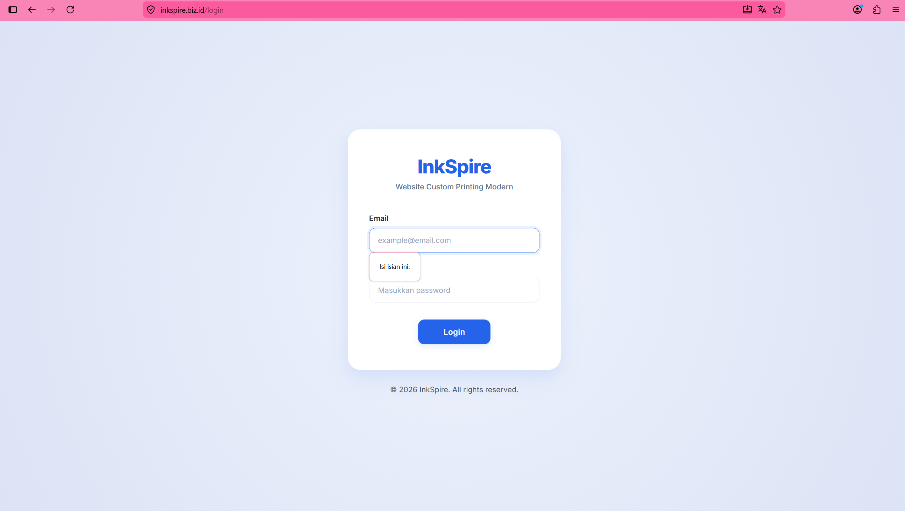

---

## 5.4 Pengujian Dashboard Pengguna

Dashboard berhasil ditampilkan setelah proses login berhasil dilakukan.

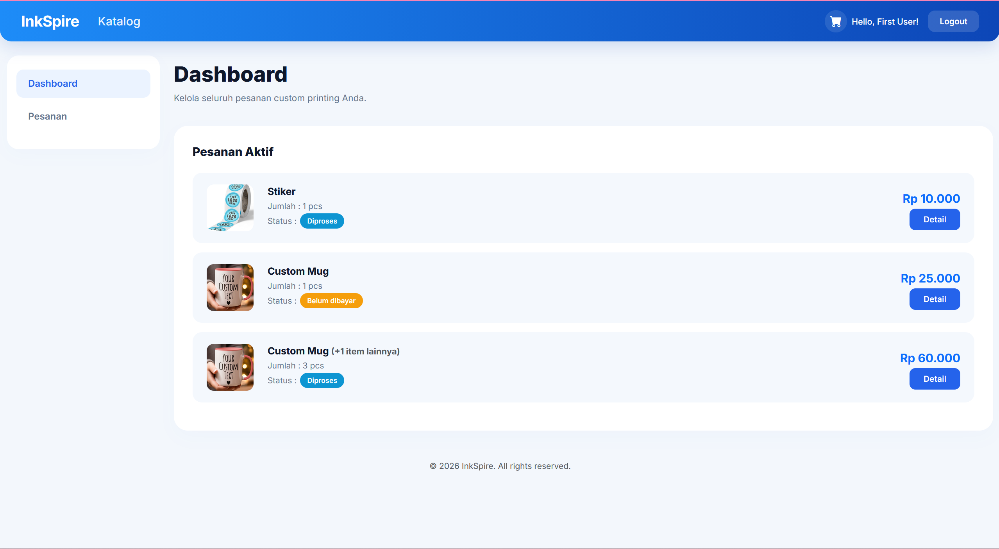

---

## 5.5 Pengujian Katalog Produk

Seluruh produk berhasil ditampilkan pada halaman katalog.

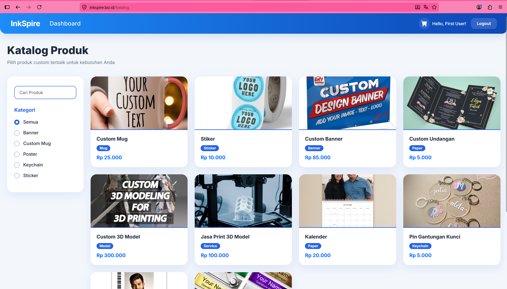

---

## 5.6 Pengujian Detail Produk

Informasi produk yang dipilih berhasil ditampilkan secara lengkap.

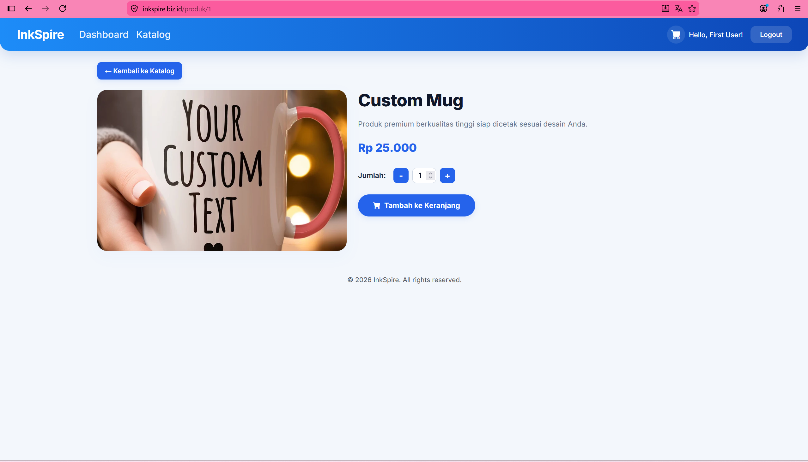

---

## 5.7 Pengujian Menambahkan Produk ke Keranjang

Produk berhasil ditambahkan ke keranjang belanja.

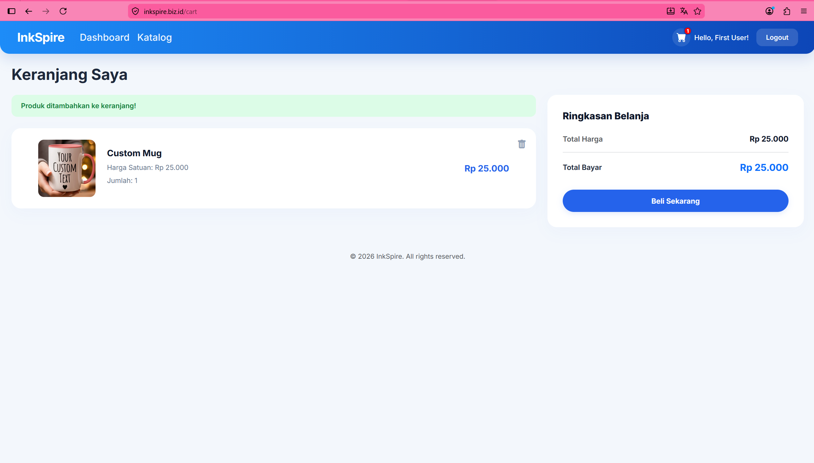

---

## 5.8 Pengujian Menghapus Produk dari Keranjang

Produk berhasil dihapus dari keranjang dan daftar produk langsung diperbarui.

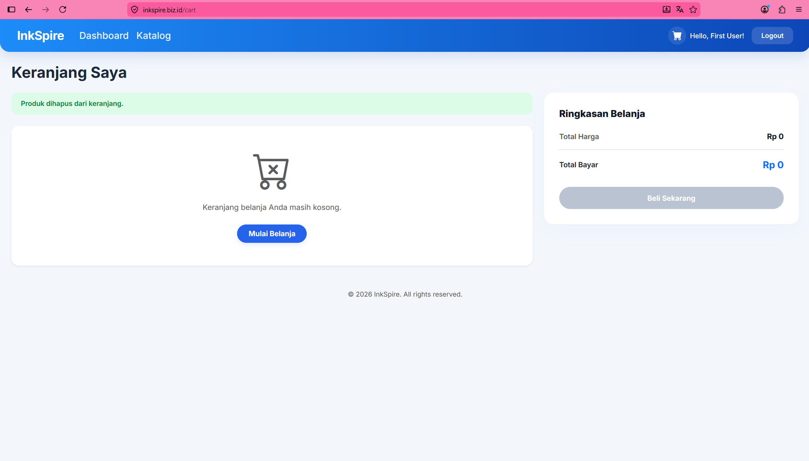

---

## 5.9 Pengujian Checkout

Checkout berhasil dilakukan dan sistem membuat pesanan baru.

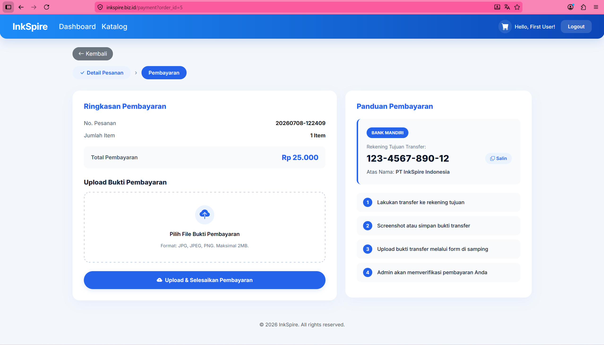

---

## 5.10 Pengujian Upload Bukti Pembayaran

Bukti pembayaran berhasil diunggah dan sistem menampilkan notifikasi bahwa pembayaran berhasil dikirim.

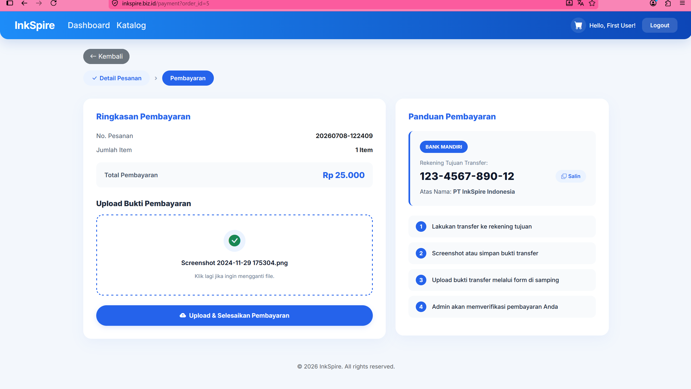

---

## 5.11 Pengujian Status Pesanan

Status pesanan berhasil ditampilkan sesuai dengan kondisi pesanan.

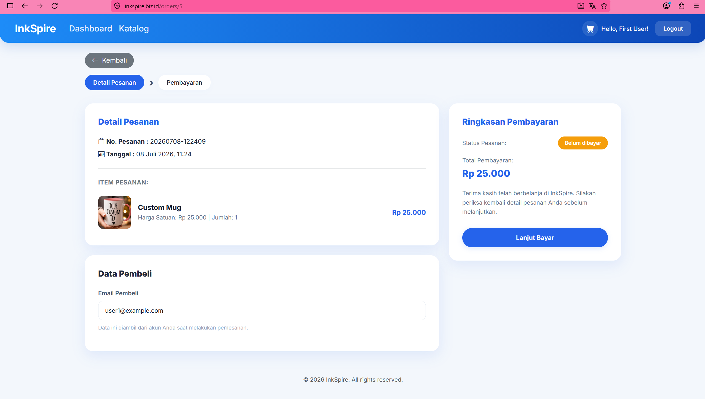

---

## 5.12 Pengujian Daftar Pesanan

Riwayat pesanan berhasil ditampilkan dan pesanan yang baru dibuat muncul pada daftar.

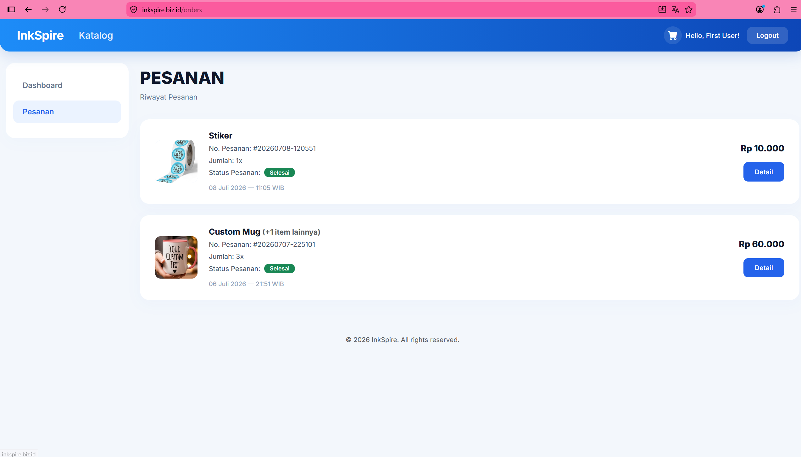

---

## 5.13 Pengujian Dashboard Admin

Dashboard admin berhasil menampilkan seluruh data pesanan.

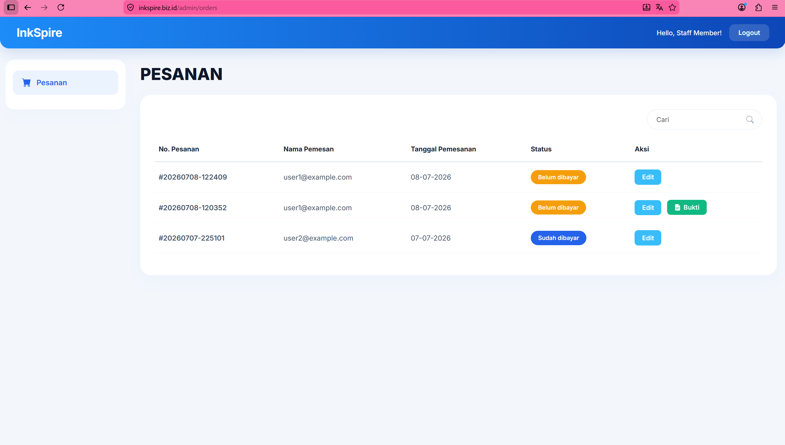

---

## 5.14 Pengujian Update Status Pesanan

Admin berhasil mengubah status pesanan dan perubahan langsung tersimpan.

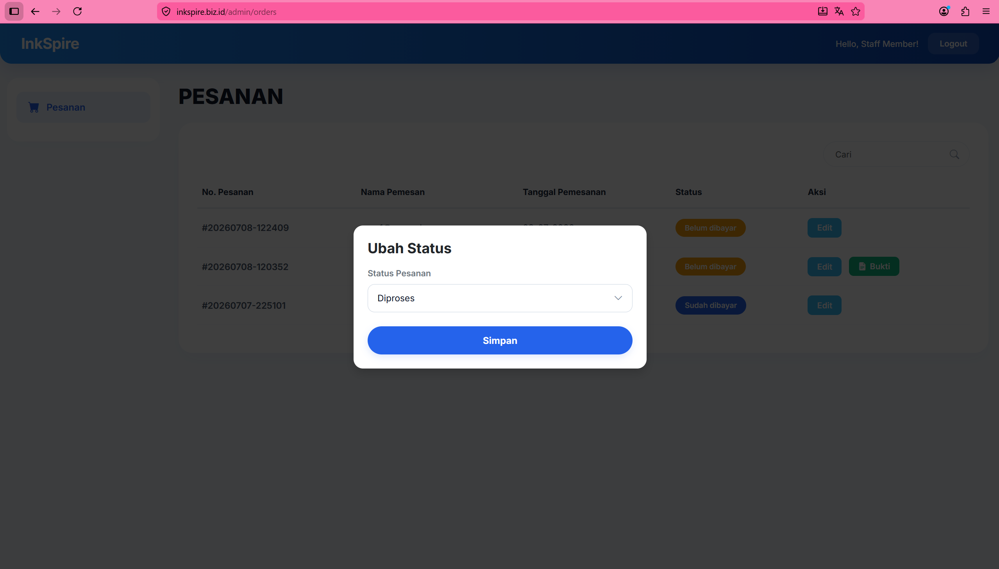

---

## 5.15 Pengujian Logout

Logout berhasil dilakukan dan sistem kembali ke halaman login.

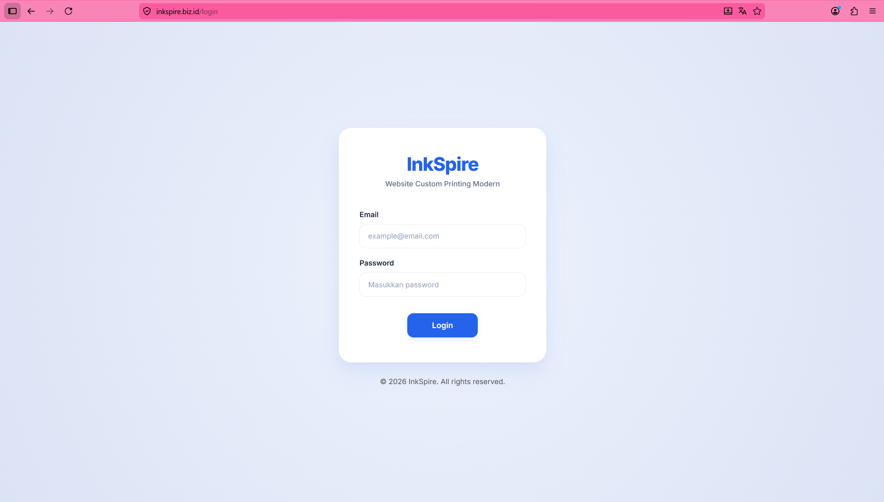
 

6. Analisis
Pengujian pada aplikasi InkSpire dilakukan menggunakan metode Black Box Testing, yaitu dengan menguji fungsi-fungsi yang tersedia tanpa melihat kode program. Pengujian difokuskan pada fitur yang paling sering digunakan oleh pengguna, mulai dari proses login, melihat katalog produk, melakukan pemesanan, hingga pengelolaan pesanan oleh admin. Seluruh pengujian dilakukan secara langsung pada aplikasi yang telah di-deploy sehingga hasil yang diperoleh menggambarkan kondisi aplikasi saat digunakan.
Pada tahap awal, pengujian dilakukan pada fitur login. Login menggunakan email dan password yang benar berhasil mengarahkan pengguna ke halaman dashboard. Ketika password yang dimasukkan salah, sistem menampilkan pesan "Invalid credentials" sehingga pengguna tidak dapat masuk ke dalam aplikasi. Selain itu, saat kolom email dikosongkan, browser menampilkan pesan "Isi isian ini". Hasil tersebut menunjukkan bahwa proses autentikasi dan validasi input telah berjalan sesuai dengan fungsinya.
Setelah berhasil login, pengujian dilanjutkan pada fitur utama yang digunakan oleh pengguna. Halaman katalog berhasil menampilkan seluruh produk yang tersedia, kemudian detail produk juga dapat dibuka tanpa kendala. Proses penambahan produk ke keranjang berjalan dengan baik dan produk yang dipilih langsung muncul pada halaman keranjang. Penghapusan produk dari keranjang juga berhasil dilakukan dan perubahan langsung terlihat pada daftar keranjang.
Selanjutnya dilakukan pengujian pada proses checkout hingga pembayaran. Sistem berhasil membuat pesanan dan mengarahkan pengguna ke halaman pembayaran. Bukti pembayaran dapat diunggah dengan baik dan sistem menampilkan notifikasi bahwa pembayaran telah berhasil dikirim. Setelah itu, status pesanan dan daftar pesanan juga berhasil ditampilkan sesuai dengan data transaksi yang telah dibuat sebelumnya.
Pengujian terakhir dilakukan menggunakan akun administrator. Dashboard admin berhasil menampilkan seluruh data pesanan yang masuk. Perubahan status pesanan dapat disimpan tanpa mengalami kendala, sehingga admin dapat mengelola proses pemesanan dengan baik. Proses logout juga berjalan sesuai harapan dengan mengakhiri sesi pengguna dan mengarahkan kembali ke halaman login.
Dari seluruh pengujian yang dilakukan, diperoleh 15 test case dengan hasil PASS dan tidak ditemukan test case yang gagal. Hal tersebut menunjukkan bahwa fungsi-fungsi utama pada aplikasi InkSpire sudah berjalan sesuai dengan kebutuhan sistem dalam ruang lingkup pengujian ini. Walaupun hasilnya sudah baik, pengujian yang dilakukan masih terbatas pada aspek fungsional. Oleh karena itu, pengujian lain seperti pengujian performa, keamanan, dan kompatibilitas pada berbagai browser tetap disarankan agar kualitas aplikasi dapat terus ditingkatkan.

7. Kesimpulan
Berdasarkan hasil pengujian yang telah dilakukan, dapat disimpulkan bahwa aplikasi InkSpire telah menjalankan fungsi-fungsi utamanya dengan baik. Pengujian dilakukan terhadap 15 test case yang mencakup proses login, dashboard pengguna, katalog produk, detail produk, keranjang belanja, checkout, upload bukti pembayaran, status pesanan, daftar pesanan, dashboard admin, pembaruan status pesanan, dan logout.
Seluruh skenario pengujian memperoleh hasil PASS, sehingga menghasilkan Pass Rate sebesar 100%, Fail Rate sebesar 0%, serta Defect Count sebesar 0. Selama proses pengujian tidak ditemukan kesalahan yang menyebabkan fitur utama gagal dijalankan. Hal ini menunjukkan bahwa aplikasi telah memenuhi kebutuhan fungsional sesuai dengan ruang lingkup pengujian yang dilakukan.
Meskipun demikian, hasil pengujian ini tidak berarti aplikasi sudah bebas dari seluruh kemungkinan masalah. Pengujian yang dilakukan masih berfokus pada fungsi utama aplikasi. Untuk pengembangan selanjutnya, disarankan agar dilakukan pengujian performa, keamanan, dan kompatibilitas pada berbagai perangkat maupun browser. Dengan adanya pengujian tambahan tersebut, kualitas aplikasi diharapkan dapat semakin baik dan lebih siap digunakan oleh pengguna dalam kondisi yang sebenarnya.
